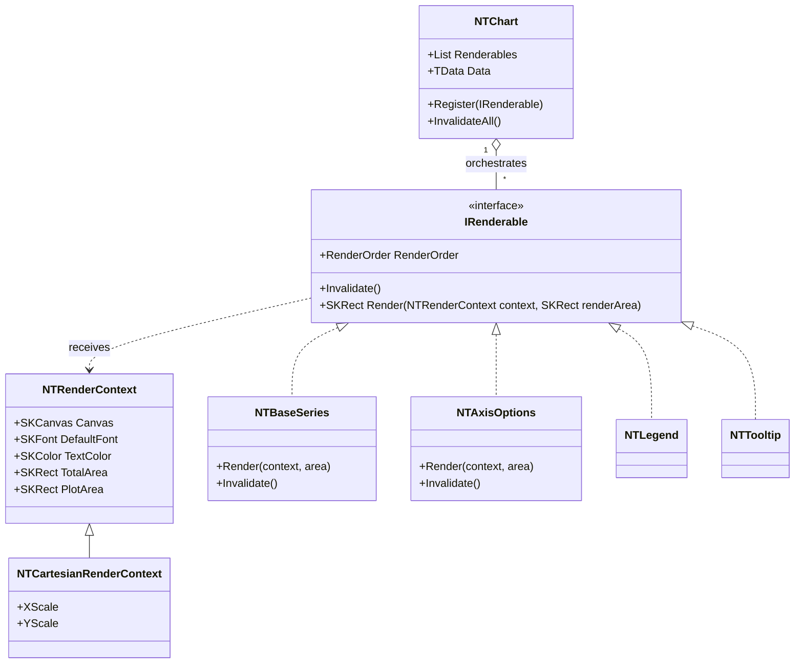

# NTComponents.Charts Architecture

This document describes the architectural structure of the NTComponents.Charts library.

## Overview

NTComponents.Charts is a high-performance rendering library for Blazor built on [SkiaSharp](https://github.com/mono/SkiaSharp). It follows a decentralized, interface-driven design where visual components are self-contained "renderables" coordinated by a central chart orchestrator.

## Core Concepts

### `IRenderable` Interface
Every visual element of the chart—including series, axes, legends, and tooltips—implements the `IRenderable` interface. This standardization allows the chart to handle all visual components through a unified pipeline.

- **`RenderOrder`**: Defines the sequence in which components are drawn (e.g., background > grid lines > series > overlays).
- **`Render(NTRenderContext context, SKRect renderArea)`**: The primary drawing method. It receives the current context and available space, and returns the *remaining* area after the component has "consumed" its required space (critical for axes and legends).
- **`Invalidate()`**: Signals the component to clear cached measurements or data transformations in preparation for a new render cycle.

### `NTRenderContext`
A state-carrying object that encapsulates the rendering environment.
- **Base Context**: Provides access to the `SKCanvas`, screen density, image information, and shared theme properties (fonts, colors).
- **Type-Specific Extensions**: `NTRenderContext` is designed to be extended for specific chart types (e.g., `NTCartesianRenderContext`). These extensions hold shared logic, scales, and coordinate transformation data that are calculated once per frame and shared among multiple `IRenderable` components.

### `NTChart<TData>`
The `NTChart` component serves as a simplified orchestrator and data provider. Its responsibilities are focused on lifecycle management rather than drawing logic:
- **Registry**: Maintains a collection of registered `IRenderable` components.
- **Orchestration**: Triggers the `Invalidate` and `Render` cycles across all components.
- **Data & Config Provider**: Acts as the central source of truth for the dataset and global style configurations (palettes, etc.).
- **Input Routing**: Captures interaction events (panning, zooming, hovering) and dispatches them to the relevant renderable components.

## Rendering Pipeline

The rendering process is a sequential flow where components collaborate to partition the available canvas:

1.  **Registration**: Visual components register themselves as `IRenderable` with the parent `NTChart` during initialization.
2.  **Invalidation**: When data or state changes occur, the chart calls `Invalidate()` on all renderables to reset their internal state.
3.  **The Render Pass**:
    - The `NTChart` initializes the appropriate `NTRenderContext` (e.g., a Cartesian context if Cartesian series are present).
    - All registered `IRenderable` objects are sorted by their `RenderOrder`.
    - The chart iterates through the sorted list, calling `Render` on each.
    - Each component performs its drawing and returns the remaining `SKRect`. For example, a `LeftAxis` might draw itself and return an area with the left margin removed, which the next component then uses as its bounds.
4.  **Interaction**: User inputs are processed by components to update scales or views, followed by a new invalidation/render cycle.

## Class Diagram

