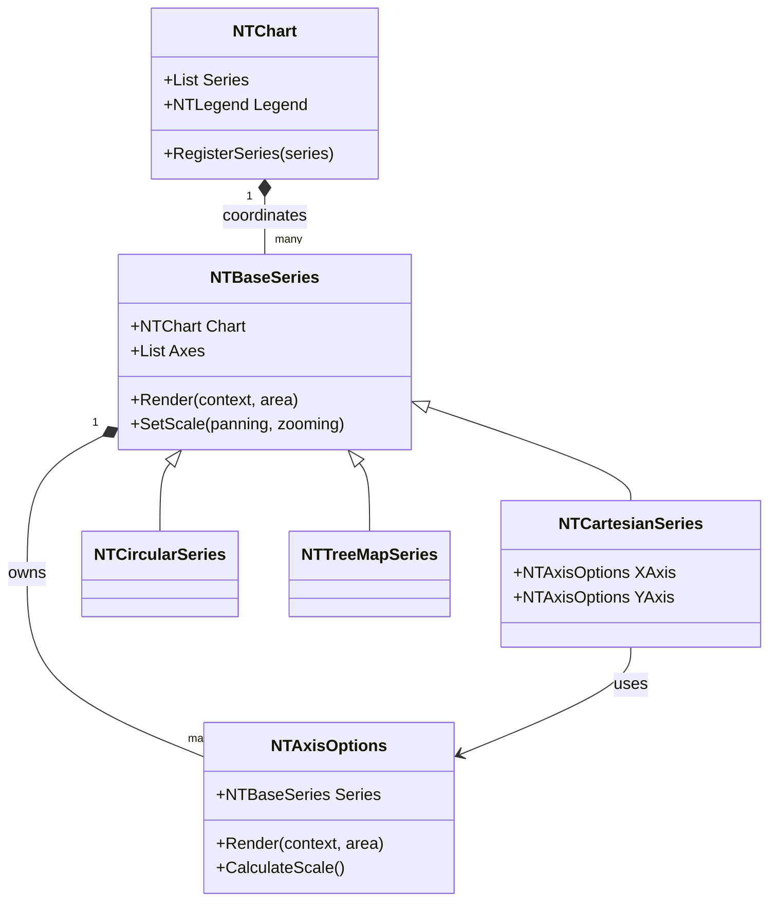

# NTComponents.Charts Architecture

This document describes the architectural structure of the NTComponents.Charts library.

## Overview

NTComponents.Charts is built on top of [SkiaSharp](https://github.com/mono/SkiaSharp) for high-performance rendering in Blazor. It follows a modular design where a central `NTChart` component coordinates various "series" and "options" components.

## Core Components

### `NTChart<TData>`
The top-level orchestrator and central coordinator for the charting system. It manages the lifecycle and high-level structure of the chart while delegating most drawing to specific components. Its primary responsibilities include:
- **Orchestration & Validation**: Handles the registration and strict validation of series as they are added (ensuring consistent coordinate systems, e.g., you cannot mix Cartesian and Circular series). Validation occurs immediately upon series registration.
- **Style Defaults**: Houses common defaults for colors, palettes, and typography used across all series.
- **Layout Foundation**: Providing each child series with the total rendering area available, calculated by subtracting chart-level margins from the total canvas size.
- **Strict Validation**: Enforcing compatibility rules as series are added. The chart ensures that all registered series share the same coordinate system (e.g., you cannot mix Cartesian and Circular series). Validation occurs immediately upon series registration.
- **Legend Management**: Managing and rendering the chart's legend.
- **Input Coordination**: Handling mouse and touch events (including panning and zooming) and dispatching them to the relevant series or components. The chart tracks interaction states using enum flags (X/Y Pan/Zoom) but delegates the actual coordinate transformation logic to the child series.

### `NTBaseSeries<TData>`
The implementation layer for data visualization. Series are "smart" components that manage their own mapping from data space to screen space. Each series is responsible for its own rendering logic within the area provided by the `NTChart`. It handles:
- **Self-Drawing**: Directly responsible for rendering their specific visualization (e.g. lines, bars) using the provided `NTRenderContext`.
- **Layout & Scale**: Calculates how much space they have to render (after margins) and determines the appropriate scales.
- **Area Partitioning**: For series with axes (like Cartesian), the series itself is responsible for determining how to split its assigned area into space for axes (labels, titles) and the actual plot area for data.
- **Axis Ownership**: Owns and manages one or more `NTAxisOptions` components to define their dimensions.
- **Tooltip Responsibility**: Responsible for their own tooltips, defining what data is shown and how it is presented when a user interacts with a data point.
- **Interaction Processing**: Handling pan and zoom events dispatched by the `NTChart` to calculate data-space transformations.
- **Hit Testing**: Determining which data point (if any) is under a given coordinate.
- **Animation**: Managing visibility and data change transitions.

### `NTCartesianSeries<TData>`
A base class for series that operate within a Cartesian coordinate system, serving as the foundation for line, bar, area, and scatter charts.
- **Axis Requirements**: Requires both an X and Y axis to map data.
- **Value Types**: The Y-axis values are strictly handled as `decimal` type, while the X-axis type is inherited from `NTBaseSeries` and can be any object (e.g., `DateTime`, `string`, or `double`).
- **Scale Management**: Manages axis references and provides range calculations for linear, categorical, and logarithmic scales.

### `NTCircularSeries<TData>`
A base class for series that use circular coordinates, such as Pie or Donut charts. It calculates slice angles and manages the rendering logic for radial data.

### `NTTreeMapSeries<TData>`
A specialized series component that visualizes hierarchical data as nested rectangles using a treemap layout algorithm.

### `NTAxisOptions`
The definition of a data dimension and an abstract base class for configuring and rendering chart axes. Axes are independent components that:
- **Self-Render**: Responsible for rendering its own scale, ticks, and labels.
- **Optional Visibility**: Some derivations (like those used in Pie or TreeMap charts) may not render at all, though they still participate in range calculations.
- **Grid Lines**: Optionally responsible for rendering grid lines across the entire plot area of the chart.
- **Scale & Range Management**: Receives data ranges (min/max) or a set of categorical values from the series and is responsible for calculating "nice" tick intervals and labels to fill the axis appropriately.
- **Formatting**: Receives an optional format parameter from the user to format rendered values (e.g., currency, dates, or custom numeric formats).
- **Calculate Scale**: Translate data values to screen coordinates (and vice versa) for the series they serve.
- **Area Participation**: Participate in the measurement phase to inform the series of the margin required for labels and titles.

### `NTRenderContext`
A helper class that encapsulates the SkiaSharp canvas and provides environment information (screen density, default fonts, theme colors) to simplify the drawing logic within components.

### `NTLegend<TData>`
Manages the display and layout of legend items. It supports multiple positions (Top, Bottom, Left, Right, Floating) and interactive toggling of series visibility.

### `NTTooltip`
Configures and renders the interactive tooltip that appears when hovering over data points, providing detailed information about the selected data.

## Rendering & Coordination Pipeline

The `NTChart` component coordinates the process, but rendering is highly decentralized:

1.  **Registration & Validation**: As series components are initialized, they register themselves with the `NTChart`. The chart validates that the new series is compatible with existing ones (e.g., matching coordinate systems).
2.  **Range Calculation**: Series determine their combined data ranges (min/max or categorical values) and provide this information to the relevant axes.
3.  **Measurement & Partitioning**:
    - The `NTChart` calculates the initial area available (total minus chart margins).
    - **Series** evaluate their children (axes). The **Axes** use the provided data ranges to calculate tick intervals and labels, then inform the series of their space requirements.
    - The **Series** then partitions the total available area into an axis area and a final plot area.
4.  **Area Allocation**: The `NTChart` provides the initial area, and the series coordinates the sub-allocation for its axes and its data plot.
5.  **Decentralized Rendering**:
    - **Self-Rendering Axes**: Each axis renders its own structure. It can also render grid lines spanning the entire plot area.
    - **Self-Rendering Series**: Each series renders its data into its allocated plot area using the scale calculations provided by its axes.
    - **Legend/Tooltip**: Rendered by the `NTChart` or dedicated overlay components.
6.  **Interaction**: User inputs (hover, click, pan, zoom) are received by the chart and delegated to the series.
    - **Control**: The `NTChart` maintains interaction permissions via enum flags (`XZoom`, `YZoom`, `XPan`, `YPan`, and combined convenience values).
    - **Logic**: The series are responsible for processing these events and calculating the resulting views or scales.
    - **Stability**: The `NTChart` render area remains constant during panning and zooming; only the series' mapping of data to that area is transformed.

## Class Diagram

